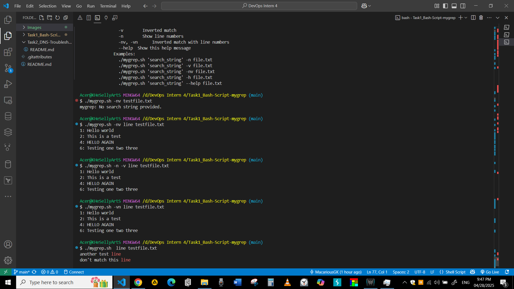
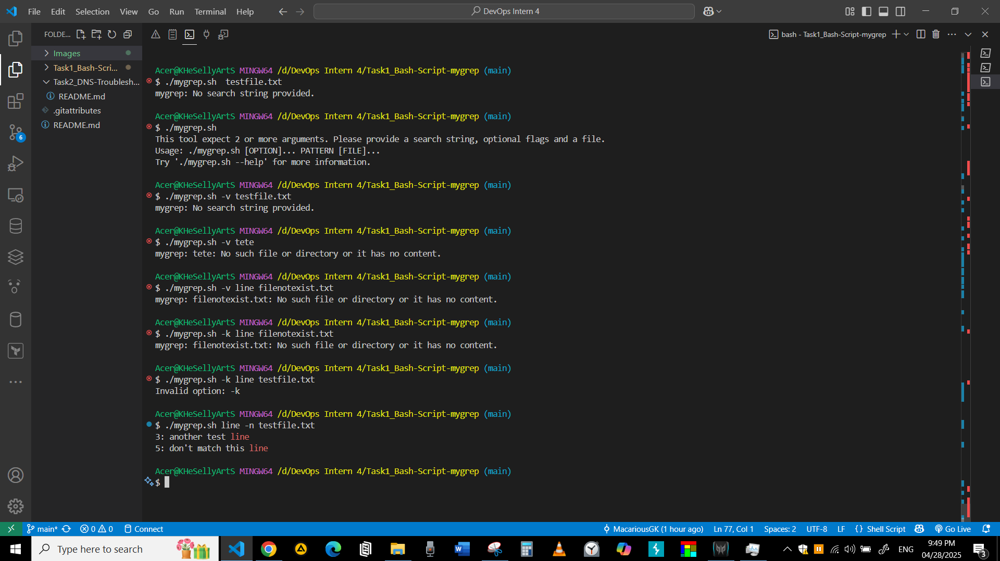
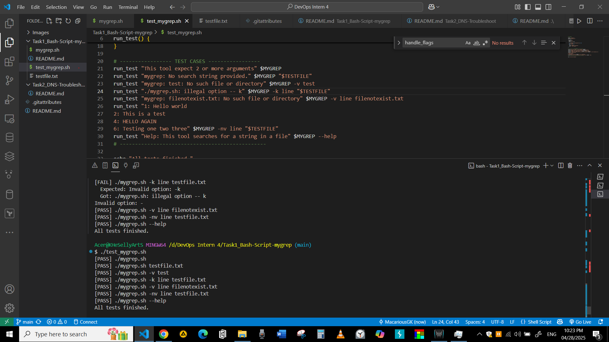

## Description
This is a custom Bash implementation of a lightweight grep-like tool called `mygrep`.  
It searches for a string pattern inside a file, supports optional flags like showing line numbers or inverted matching, and highlights matches in color.  
It also includes basic validation for file existence, correct argument count, and offers a helpful `--help` feature.

Additionally:
- A script was created to test most of the scenarios for using this tool, automating the testing process when upgrading or modifying the code.
- Improved option parsing using `getopts` for more robust and flexible flag handling.

## Features
- Case-insensitive search.
- Highlight matching strings in red color.
- Handle multiple flags: `-v`, `-n`, `-nv`, `-vn`, `--help`.
- Input validations: check for missing files, missing arguments, and invalid options.

## Core Logic Functions
### 1. `check_file`
Checks if the provided file exists and is not empty.  
Exits with an error if the file is missing or empty.

### 2. `check_missing_args`
Verifies that at least two arguments are provided (search string and file).  
Exits with a helpful message if arguments are missing.

### 3. `check_missing_search_string`
Ensures that the search string is present.  
Exits if not provided.

### 4. `parse_args`
Parses all command-line arguments to extract flags, search string, and file.  
Also handles immediate execution of `--help`.

### 5. `handle_flags`
Handles simple flags parsing (`-n`, `-v`, `-nv`, `-vn`).

### 6. `handle_flags_with_getopts`
Handles flags parsing using `getopts` for better flag processing.

### 7. `mygrep_simple_search`
Performs a basic case-insensitive search and highlights matches (without flags).

### 8. `mygrep_flag_supported_search`
Handles searching while considering flags like line numbering (`-n`) and inverted match (`-v`).

### 9. `Help_message`
Contains the help information that is displayed when using the `--help` flag.

### 10. `--help`
**Parameters**: None  
- Displays the usage information and options for the script.

## For testing
``` bash
 ./test_mygrep.sh
``` 

## Screenshots
 **Screenshot_Basic_functions** 


 **Screenshot_Basic_functions** 


 **Screenshot_corner_cases** 


 **Screenshot_Testing_script** 


<!-- 
### Task needed to be covered:
- 1 Create initial version of the script as a beginning to do the simplest funcition like `find the first match` from String or file
- 1 Update the script to `print the matching lines` from a text file 
- 1 Enhancing visablity by adding `different color for the matching` words in the lines 
- Enable `Case sensitive` in my script
- Hard Coded option: Adding the functionality of `Showing line numbers` for each match 
- Hard Coded option: `Invert the match` (print lines that do not match)
- Implement `Flag arguments`
- Brain storming for corner cases
- Implement error handling for corner cases
- Optimize the Flags by `parsing using getopts`
- Add the tool to the `/bin`
- Finish `Readme Guide` for the tool

---
### notes
use for =~
use <, cat, IFS for reading file 
use -e, -f, -s for validate file exixts
 -->


### Resourses
- https://www.youtube.com/watch?v=nBH5z2H5BIY
- https://www.w3schools.com/bash/bash_functions.php
- https://dev.to/ifenna__/adding-colors-to-bash-scripts-48g4
- https://dev.to/arsenikavalchuk/match-a-string-with-regular-expression-in-bash-3125#:~:text=In%20Bash%2C%20matching%20strings%20against,checks%20directly%20in%20Bash%20scripts.
- https://kodekloud.com/blog/bash-getopts/#parsing-command-line-options-using-positional-parameters


t