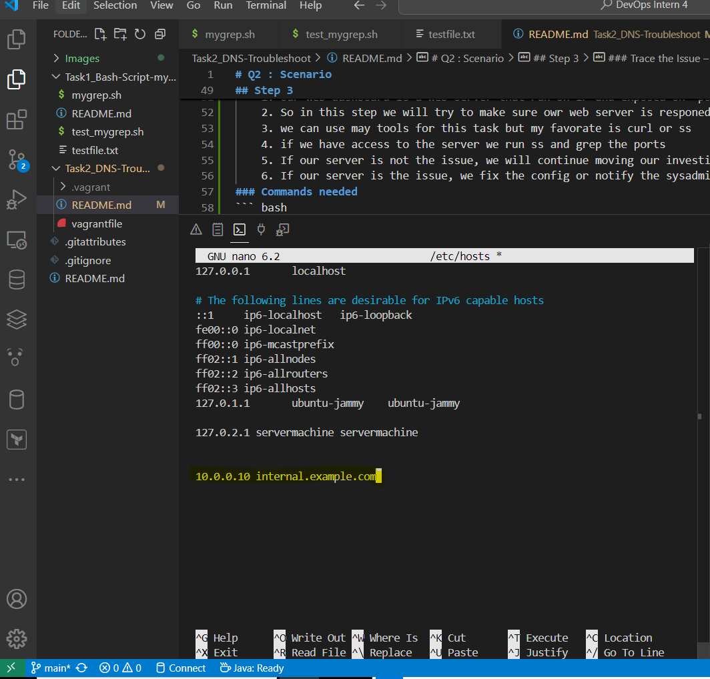

# Q2 : Scenario
## Description


## Step 1
### Verify DNS Resolution:
    1. In this part, I will compare the resolution results from the system DNS configured in /etc/resolv.conf against Google's public DNS 8.8.8.8
    2. This is to ensure that the system's DNS can resolve domains in the same way as Google DNS.
    3. If both resolutions are successful and consistent, then the system DNS is not the source of the issue.
    4. If the system DNS is identified as the root cause, we will notify the system administrator. if it is our responsiblity and if the system is using an internal DNS server, we will attempt to fix the DNS configuration.
    5. If DNS is not the issue, we will continue moving our investigation forward.
### Commands needed
``` bash
# check nameserver used by system located in this file /etc/resolv.conf
cat /etc/resolv.conf
# Using dig tool I can compare the DNS Server that my System currently use againest Google DNS Server
dig internal.example.com
dig @8.8.8.8 internal.example.com
```
### Screenshots
 **Verify DNS Resolution** 


## Step 2
### Diagnose Service Reachability:
    1. Our web dashboard is a web server that run on IP and exposed on `port 80` if **HTTP** and port `443` if **HTTPS** 
    2. So in this step we will try to make sure owr web server is responed the way it expected on these ports
    3. we can use may tools for this task but my favorate is curl or ss
    4. if we have access to the server we run ss and grep the ports
    5. If our server is not the issue, we will continue moving our investigation forward.
    6. If our server is the issue, we fix the config or notify the sysadmin
### Commands needed
``` bash
# check the web server using curl 
curl -v http://internal.example.com# 

sudo ss -tuln | grep ':80\|:443'
sudo systemctl status apache2

```
### Screenshots
 **Diagnose Service Reachability** 


## Step 3
### Trace the Issue – List All Possible Causes:
    1. Our web dashboard is a web server that run on IP and exposed on `port 80` if **HTTP** and port `443` if **HTTPS** 
    2. So in this step we will try to make sure owr web server is responed the way it expected on these ports
    3. we can use may tools for this task but my favorate is curl or ss
    4. if we have access to the server we run ss and grep the ports
    5. If our server is not the issue, we will continue moving our investigation forward.
    6. If our server is the issue, we fix the config or notify the sysadmin
### Commands needed
``` bash
# check the web server using curl 
curl -v http://internal.example.com# 

sudo ss -tuln | grep ':80\|:443'
sudo systemctl status apache2

```
### Screenshots
 **Diagnose Service Reachability** 


### Bonus
 **Configure a local /etc/hosts entry to bypass DNS for testing** 


### Using systemd-resolved (Ubuntu / Debian)

### Resourses
- https://totaluptime.com/top-6-tools-for-dns-troubleshooting/
- 