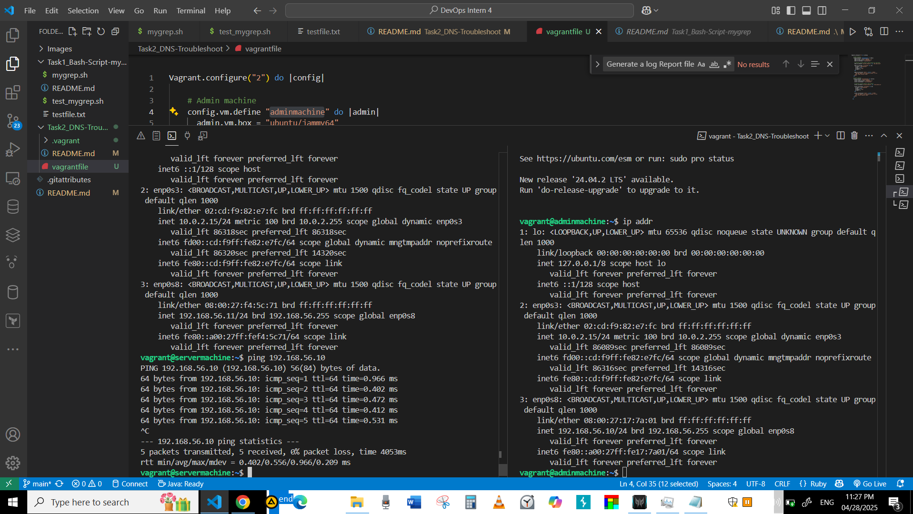

# Q2 : Scenario
## Description


## Step 1
### Verify DNS Resolution:
    1. In this part, I will compare the resolution results from the system DNS configured in /etc/resolv.conf against Google's public DNS 8.8.8.8
    2. This is to ensure that the system's DNS can resolve domains in the same way as Google DNS.
    3. If both resolutions are successful and consistent, then the system DNS is not the source of the issue.
    4. If the system DNS is identified as the root cause, we will notify the system administrator. if it is our responsiblity and if the system is using an internal DNS server, we will attempt to fix the DNS configuration.
    5. If DNS is not the issue, we will continue moving our investigation forward.
### Commands needed
``` bash
# check nameserver used by system located in this file /etc/resolv.conf
cat /etc/resolv.conf
# Using dig tool I can compare the DNS Server that my System currently use againest Google DNS Server
dig internal.example.com
dig @8.8.8.8 internal.example.com
```
### Screenshots
 **Verify DNS Resolution** 


## Screenshots

 **Screenshot_Basic_functions** 


 **Screenshot_Basic_functions** 


 **Screenshot_corner_cases** 


### Resourses
- https://totaluptime.com/top-6-tools-for-dns-troubleshooting/
- 